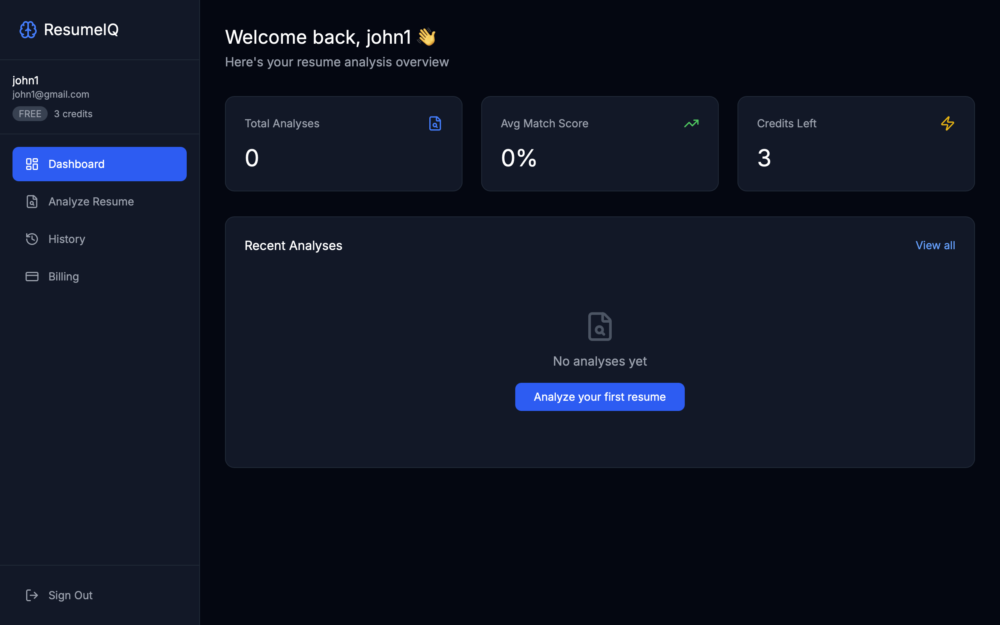
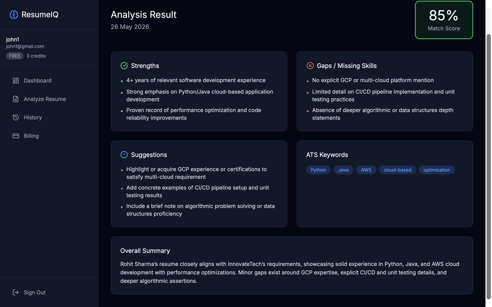
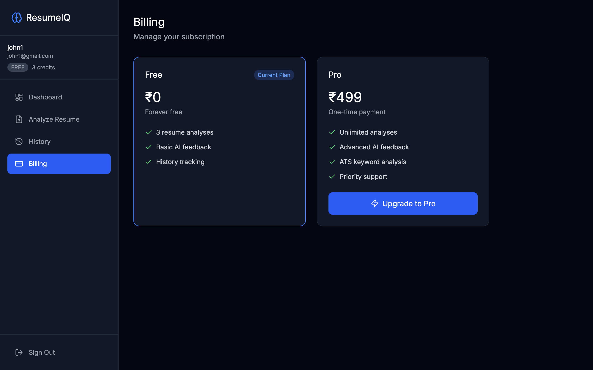

# ResumeIQ

> An AI-powered resume analyzer SaaS — paste your resume, paste a job description, get an instant match score, skill gap report, and ATS optimization tips.

ResumeIQ lets job seekers analyze how well their resume matches a job description using AI. It returns a structured score, strengths, gaps, keyword suggestions, and improvement tips. Authentication is JWT-based with role separation (user vs. admin). Free users get 3 analyses. Pro users get unlimited access via a one-time Razorpay payment.

[](./LICENSE)
[](https://nextjs.org)
[](https://www.typescriptlang.org)
[](https://supabase.com)
[](https://github.com/Thryyve/resumeiq/stargazers)
[](https://github.com/Thryyve/resumeiq/network/members)

---

🌐 **Live Demo:** [resumeiq-phi.vercel.app](https://resumeiq-phi.vercel.app)

---

## 📸 Screenshots

| Landing Page | Dashboard |
|---|---|
|  |  |

| Analysis Result | Billing |
|---|---|
|  |  |

---

## Table of Contents

- [Features](#-features)
- [Tech Stack](#-tech-stack)
- [Getting Started](#-getting-started)
  - [Prerequisites](#prerequisites)
  - [Installation](#installation)
  - [Environment Variables](#environment-variables)
  - [Running the Project](#running-the-project)
- [Project Structure](#-project-structure)
- [API Documentation](#-api-documentation)
- [Deployment](#-deployment)
- [Contributing](#-contributing)
- [Author](#-author)

---

## ✨ Features

- [x] JWT-based authentication with NextAuth.js — register, login, protected routes via middleware
- [x] Role-based access control — `USER` and `ADMIN` roles with server-side enforcement
- [x] AI resume analysis via OpenRouter — returns match score, strengths, gaps, suggestions, ATS keywords
- [x] Credit system — free users get 3 analyses, Pro users get unlimited access
- [x] Razorpay payment integration — one-time ₹499 payment with HMAC signature verification
- [x] Full analysis history — every result saved and viewable per user
- [x] Dashboard with usage analytics — total analyses, average score, match score trend chart
- [x] Admin panel — platform-wide user count, analysis count, pro users, revenue tracking
- [x] Fully responsive UI — works on mobile and desktop

---

## 🛠️ Tech Stack

| Area | Technologies |
|---|---|
| **Frontend** | Next.js 14 (App Router), TypeScript, Tailwind CSS, Recharts |
| **Backend** | Next.js API Routes (Node.js runtime) |
| **Database** | PostgreSQL via Supabase, Prisma ORM v5 |
| **Auth** | NextAuth.js v4, JWT strategy, bcryptjs |
| **AI** | OpenRouter API (`openrouter/free` model) |
| **Payments** | Razorpay — order creation + HMAC signature verification |
| **Deployment** | Vercel (app), Supabase (database) |

---

## 🚀 Getting Started

### Prerequisites

- [Git](https://git-scm.com/)
- [Node.js](https://nodejs.org/) **v22+**
- A [Supabase](https://supabase.com) project with PostgreSQL
- An [OpenRouter](https://openrouter.ai) API key (free tier)
- A [Razorpay](https://razorpay.com) account (test mode works)

### Installation

**1. Clone the repository**

```bash
git clone git@github.com:Thryyve/resumeiq.git
cd resumeiq
```

**2. Install dependencies**

```bash
npm install
```

**3. Configure environment variables**

```bash
cp .env.example .env
```

Edit `.env` with your values — see [Environment Variables](#environment-variables) below.

**4. Push database schema**

```bash
npx prisma db push
```

**5. Generate Prisma client**

```bash
npx prisma generate
```

### Environment Variables

| Variable | Description |
|---|---|
| `DATABASE_URL` | Supabase session pooler connection string |
| `DIRECT_URL` | Supabase direct connection string (used by Prisma migrations) |
| `NEXTAUTH_URL` | Full app URL — `http://localhost:3000` in dev, production URL on Vercel |
| `NEXTAUTH_SECRET` | Random secret string for JWT signing |
| `OPENROUTER_API_KEY` | OpenRouter API key for AI inference |
| `RAZORPAY_KEY_ID` | Razorpay public key |
| `RAZORPAY_KEY_SECRET` | Razorpay secret key — used server-side only for HMAC verification |
| `NEXT_PUBLIC_RAZORPAY_KEY_ID` | Razorpay public key exposed to client for checkout initialization |

### Running the Project

```bash
# Development
npm run dev

# Production build
npm run build
npm start
```

---

## 📁 Project Structure

```
resumeiq/
├── prisma/
│   └── schema.prisma              # Database schema — User, Analysis, Payment models
├── src/
│   ├── app/
│   │   ├── (auth)/                # Auth route group — no shared layout
│   │   │   ├── login/page.tsx
│   │   │   └── register/page.tsx
│   │   ├── (dashboard)/           # Protected route group — shared sidebar layout
│   │   │   ├── layout.tsx         # Session check + Sidebar render
│   │   │   ├── dashboard/page.tsx # Stats cards + score trend chart
│   │   │   ├── analyze/page.tsx   # Resume + JD input form
│   │   │   ├── history/page.tsx   # Analysis history list
│   │   │   ├── history/[id]/page.tsx # Analysis detail — score, strengths, gaps
│   │   │   └── billing/page.tsx   # Free vs Pro plan + Razorpay checkout
│   │   ├── (admin)/
│   │   │   └── admin/page.tsx     # Admin panel — users, revenue, usage
│   │   ├── api/
│   │   │   ├── auth/[...nextauth]/route.ts  # NextAuth handler
│   │   │   ├── auth/register/route.ts       # User registration
│   │   │   ├── analyze/route.ts             # AI analysis — auth, credits, OpenRouter, save
│   │   │   ├── payment/create-order/route.ts # Razorpay order creation
│   │   │   └── payment/verify/route.ts       # HMAC verification + plan upgrade
│   │   ├── layout.tsx             # Root layout — SessionProvider
│   │   └── page.tsx               # Landing page
│   ├── components/
│   │   ├── layout/
│   │   │   ├── Sidebar.tsx        # Nav links, user info, plan badge, sign out
│   │   │   └── Providers.tsx      # SessionProvider client wrapper
│   │   └── dashboard/
│   │       └── AnalyticsChart.tsx # Recharts LineChart for score trend
│   ├── lib/
│   │   ├── auth.ts                # NextAuth config — CredentialsProvider, JWT callbacks
│   │   └── prisma.ts              # Prisma singleton client
│   ├── types/
│   │   └── next-auth.d.ts         # Session type extension — id, role, plan, credits
│   └── middleware.ts              # Route protection — JWT check on all /dashboard/* routes
├── .env.example
├── next.config.ts
├── package.json
└── tsconfig.json
```

---

## 🌐 API Documentation

All requests use JSON bodies. Protected routes require a valid NextAuth session cookie.

| Method | Endpoint | Description | Auth |
|---|---|---|---|
| `POST` | `/api/auth/register` | Register new user with name, email, password | — |
| `POST` | `/api/auth/[...nextauth]` | NextAuth login, logout, session handler | — |
| `POST` | `/api/analyze` | Run AI analysis — checks credits, calls OpenRouter, saves result, decrements credit | ✅ User |
| `POST` | `/api/payment/create-order` | Create Razorpay order for ₹499 Pro plan | ✅ User |
| `POST` | `/api/payment/verify` | Verify HMAC signature, save payment, upgrade user to PRO | ✅ User |

**Analysis response shape:**
```json
{
  "matchScore": 78,
  "summary": "Strong candidate with relevant experience...",
  "strengths": ["React experience", "REST API knowledge"],
  "gaps": ["Missing TypeScript", "No cloud experience"],
  "suggestions": ["Add TypeScript projects", "Get AWS certified"],
  "keywords": ["React", "Node.js", "REST API", "JavaScript", "Git"]
}
```

---

## 🚢 Deployment

**App → Vercel**

1. Connect the repository to a new Vercel project
2. Add all environment variables in Vercel → Settings → Environment Variables
3. Set `NEXTAUTH_URL` to your production Vercel URL
4. Build command is pre-configured: `prisma generate && next build`

**Database → Supabase**

1. Create a new Supabase project
2. Use **Session pooler** URL for `DATABASE_URL`
3. Use **Direct connection** URL for `DIRECT_URL`
4. Run `npx prisma db push` to create all tables

---

## 🤝 Contributing

1. Fork the repository
2. Create a feature branch: `feat/<short-description>`
3. Commit using [Conventional Commits](https://www.conventionalcommits.org/):
   ```
   feat: add PDF resume upload
   fix: handle OpenRouter timeout
   docs: update API documentation
   ```
4. Push your branch and open a Pull Request

---

## 👤 Author

Made by **Aayam Sinha**

[](https://www.linkedin.com/in/aayam-sinha/)
[](mailto:sinhaaayam12@email.com)